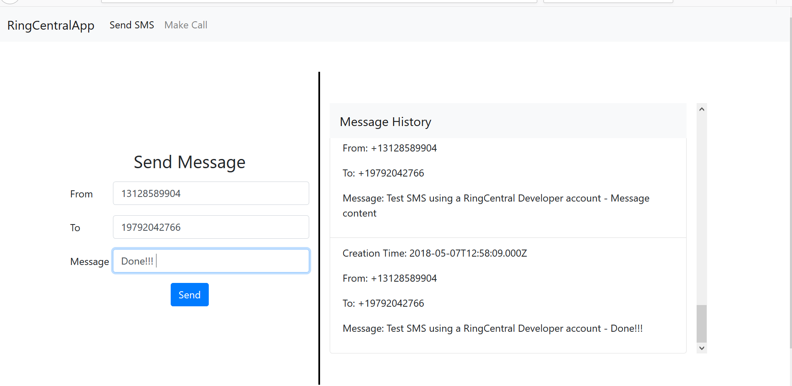
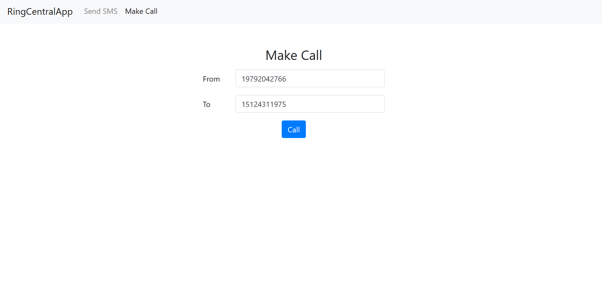

# SendSMSAndCall

The application provides Message and Call functionality using the Ringcentral API. 

### Send SMS and View Message History

The client accesses the application through the web browser.
As you can see the in the image above, the web applications displays outgoing message history in the panel to the right. This is done by sending a 'GET' request to the server on load.
```javascript
$(document).ready(function () {
            $('#CallPanel').hide();
            $('#SendButton').prop('disabled', true);
            $('#CallButton').prop('disabled', true);

           $.ajax({
                type: 'GET',
                url: '/messages',
                success: function (data) {
                    var records = JSON.parse(data);
                    records.reverse()
                    var $histroyPanel = $('#messageHistory');
                    if (records.length == 0) {
                        $histroyPanel.append('<li class="list-group-item"><p>No Messages Sent in the last 24hrs</p></li>');
                    } else {
                        $.each(records, function (i, record) {
                            $histroyPanel.append('<li class="list-group-item"><p>Creation Time: '+ record.time 
                            + '</p><p>From: ' + record.from 
                            + '</p> <p>To: ' + record.to 
                            + '</p> <p>Message: ' + record.subject + '</p></li>');
                        });
                    }
                }
            });
        });
```

Users can also use the application to send new messages by entering valid phone numbers and a message. If the message is successfully sent then it is automatically appended to the message history panel. Below is the 'POST' request to send a new message.

```javascript
       $('#SendButton').on('click', function () {
            var sms = {
                from: $('#inputFromNum').val(),
                to: $('#inputToNum').val(),
                message: $('#inputMessage').val()
            };
            $.ajax({
                type: 'POST',
                url: '/messages?to=' + sms.to + '&from=' + sms.from + '&message=' + sms.message,
                success: function (data) {
                    var $histroyPanel = $('#messageHistory');
                    var record = JSON.parse(data);
                    $histroyPanel.append('<li class="list-group-item"><p>Creation Time: ' + record.time 
                    + '</p><p>From: ' + record.from 
                    + '</p> <p>To: ' + record.to
                    + '</p> <p>Message: ' + record.subject + '</p></li>');
                }
            });
        });
```
### Make Call

The user can also make calls by giving valid phone numbers as input. Below is the 'POST' request to make new calls.

```javascript
      $('#CallButton').on('click', function () {
            var sms = {
                from: $('#inputFromNumCall').val(),
                to: $('#inputToNumCall').val()
            };
            $.ajax({
                type: 'POST',
                url: '/calls?to=' + sms.to + '&from=' + sms.from,
                success: function (data) {
                    var record = JSON.parse(data);
                    alert("Success!!");
                }
            });
        })
```

### Node.js Server
On the server side we do password flow authentication.

```javascript
    platform.login({
        username: process.env.RINGCENTRAL_USERNAME,
        extension: process.env.RINGCENTRAL_EXTENSION,
        password: process.env.RINGCENTRAL_PASSWORD
    }).then(response =>
```
Upon receiving a 'GET' request from the client the server contacts Ringcentral to get the message history.

```javascript
        if (pathname === "/messages") {

            console.log('get messages');
            getMessages(req, res);

        } 
```
getMessages(res,req):

```javascript
function getMessages(req, res) {

    var retVal = [];
    platform.login({
        username: process.env.RINGCENTRAL_USERNAME,
        extension: process.env.RINGCENTRAL_EXTENSION,
        password: process.env.RINGCENTRAL_PASSWORD
    }).then(response => {
        platform.get('/account/~/extension/~/message-store', { direction: 'Outbound' }).then(response => {
            const messages = response.json().records
            console.log(`We get of a list of ${messages.length} messages`);

            for (var i = 0; i < messages.length; i++) {
                retVal.push({
                    from: messages[i].from.phoneNumber,
                    to: messages[i].to[0].phoneNumber,
                    subject: messages[i].subject,
                    time: messages[i].creationTime
                });
            }
            res.writeHead(200, { "Content-Type": "text/html" });
            res.write(JSON.stringify(retVal));
            res.end();
        })
    }).catch(e => {
        console.error(e)
    });

    return retVal;
}
```
Upon receiving a 'POST' request from the client the server based on the pathname (\messages and \calls) contacts Ringcentral to send a message history or make a call.

```javascript
     if (req.method === "POST") {

        if (pathname === "/messages"){
            if(qdata.from != null && qdata.to != null && qdata.message != null){
                console.log("post messages");
                sendMessages(req, res, qdata.from, qdata.to, qdata.message);
            }
        }else if(pathname === "/calls"){
            if(qdata.from != null && qdata.to != null){
                console.log("post calls");
                makeCall(req, res, qdata.from, qdata.to);
            }
        }
    }
```
sendMessages(req, res, qdata.from, qdata.to, qdata.message):

```javascript
function sendMessages(req, res, from, to, message) {
    var retVal = null;

    platform.login({
        username: process.env.RINGCENTRAL_USERNAME,
        extension: process.env.RINGCENTRAL_EXTENSION,
        password: process.env.RINGCENTRAL_PASSWORD
    }).then(response => {
        platform.post('/account/~/extension/~/sms', {
            from: { phoneNumber: from },
            to: [
                { phoneNumber: to }
            ],
            text: message
        }).then(response => {
            const message = response.json();
            retVal = {
                from: message.from.phoneNumber,
                to: message.to[0].phoneNumber,
                subject: message.subject,
                time: message.creationTime
            };
            res.writeHead(200, { 'Content-Type': 'text/html' });
            console.log('retval ' + retVal);
            res.end(JSON.stringify(retVal));
        }).catch(e => {
            console.error(e)
        })
    }).catch(e => {
        console.error(e)
    })

}
```

makeCall(req, res, qdata.from, qdata.to):

```javascript
function makeCall(req, res, from, to) {
    var retVal = null;

    platform.login({
        username: process.env.RINGCENTRAL_USERNAME,
        extension: process.env.RINGCENTRAL_EXTENSION,
        password: process.env.RINGCENTRAL_PASSWORD
    }).then(response => {
        platform.post('/account/~/extension/~/ring-out', {
            from: {
                phoneNumber: from
            },
            to: {
                phoneNumber: to
            },
            callerId: {
                phoneNumber: process.env.RINGCENTRAL_USERNAME
            },
            playPrompt: false,
            country: {
                id: "1"
            }

        }).then(response => {
            const message = response.json();
            res.writeHead(200, { 'Content-Type': 'text/html' });
            console.log(message.status.callStatus);
            res.end(JSON.stringify(message));
        }).catch(e => {
            console.error(e)
        })
    }).catch(e => {
        console.error(e)
    })

}
```

